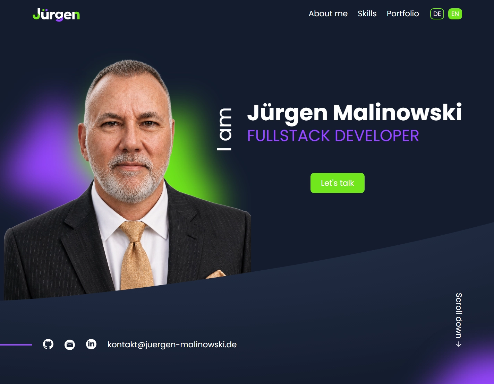

# Jürgen Malinowski – Developer Portfolio

Personal portfolio website built with Angular and TypeScript to present my work, technical skills, professional background, and selected web development projects.

The application combines responsive frontend development, bilingual German/English content, project presentations, legal pages, and a functional contact form in a single-page application.

<br>

[](https://portfolio.juergen-malinowski.de)

<br>



---

## Setup / Quick Start

Clone the repository, install the dependencies, and start the local development server:

```bash
git clone https://github.com/Juergen-Malinowski/portfolio.git
cd portfolio
npm install
npm start
```

Then open:

```text
http://localhost:4200/
```

---

## Table of Contents

- [Project Overview](#project-overview)
- [Main Features](#main-features)
- [Tech Stack](#tech-stack)
- [Project Structure](#project-structure)
- [Application Areas](#application-areas)
  - [Landing Page](#landing-page)
  - [About Me](#about-me)
  - [Skills](#skills)
  - [Projects](#projects)
  - [Contact](#contact)
- [Internationalization](#internationalization)
- [Contact Form](#contact-form)
- [Routing and Legal Pages](#routing-and-legal-pages)
- [Responsive Design](#responsive-design)
- [Build and Testing](#build-and-testing)
- [Deployment](#deployment)

---

## Project Overview

This portfolio was developed as a personal application for presenting my work as a Fullstack Web Developer.

The site follows a Figma-based design and is implemented as an Angular single-page application using standalone components. The main page combines the Hero, About Me, Skills, Projects, and Contact sections, while the Imprint and Privacy Policy are provided through dedicated Angular routes.

The portfolio is designed not only as a visual presentation, but also as a technical reference. It demonstrates component-based Angular development, responsive SCSS architecture, internationalization, form validation, routing, HTTP communication, and production deployment on static web hosting.

---

## Main Features

- Responsive single-page portfolio
- German and English language switching
- Figma-based responsive implementation
- About Me and Skills sections
- Dynamic project presentation
- GitHub and live-demo links for portfolio projects
- Responsive desktop, tablet, and mobile navigation
- Angular Reactive Forms contact form
- Validation triggered on blur for text fields
- Privacy Policy acknowledgement before submission
- PHP-based contact form backend
- Server-side input validation and spam honeypot
- Dedicated Imprint and Privacy Policy routes
- Smooth in-page navigation
- Custom branding, local fonts, and optimized favicon
- Apache SPA fallback for direct Angular route access
- Production deployment on ALL-INKL.COM with enforced HTTPS

---

## Tech Stack

| Technology | Purpose |
| --- | --- |
| **Angular 20** | Application framework and standalone component architecture |
| **TypeScript** | Application logic and typed component code |
| **SCSS** | Component styling and responsive layouts |
| **Angular Router** | Main page and legal page routing |
| **Angular Reactive Forms** | Contact form state and validation |
| **Angular HttpClient** | Communication with the contact form endpoint |
| **ngx-translate** | German/English internationalization |
| **RxJS** | Reactive Angular infrastructure and HTTP handling |
| **PHP** | Server-side contact form processing |
| **Apache / .htaccess** | Single-page application fallback for production routing |
| **Git & GitHub** | Version control and feature-branch workflow |

---

## Project Structure

The project separates the Angular application, public assets, translations, legal pages, shared components, and the server-side contact endpoint.

```text
portfolio/
├── public/
│   ├── fonts/
│   ├── i18n/
│   │   ├── de.json
│   │   └── en.json
│   ├── img/
│   ├── .htaccess
│   ├── favicon.png
│   └── portfolio.webp
├── server/
│   └── contact.php
├── src/
│   ├── app/
│   │   ├── legal/
│   │   │   ├── imprint/
│   │   │   └── privacy/
│   │   ├── mainpage/
│   │   │   ├── about/
│   │   │   ├── contact/
│   │   │   ├── landingpage/
│   │   │   ├── projects/
│   │   │   └── skills/
│   │   └── shared/
│   │       ├── footer/
│   │       └── header/
│   ├── styles/
│   ├── index.html
│   ├── main.ts
│   └── styles.scss
├── angular.json
├── package.json
└── README.md
```

---

## Application Areas

### Landing Page

The Hero section introduces the portfolio and provides direct access to the contact area, GitHub, LinkedIn, and the main content sections.

Responsive decorative assets, typography, the portrait, and the Hero wave are adapted across mobile, tablet, desktop, and widescreen layouts.

### About Me

The About section presents my background as a Fullstack Web Developer as well as experience in business, communication, team leadership, structured problem solving, and continuous technical learning.

A separate professional portrait is used for this section.

### Skills

The Skills section presents technologies from frontend development, backend development, databases, testing, deployment, and development tooling.

The current skill set includes technologies such as Angular, TypeScript, Python, Django, Django REST Framework, PostgreSQL, Firebase, Docker, Linux, Nginx, Gunicorn, pytest, Git, and GitHub.

### Projects

The portfolio currently presents five deployed development projects:

| Project | Focus | Repository | Live Demo |
| --- | --- | --- | --- |
| **Coderr** | Django / Django REST Framework backend for a freelancer platform | [GitHub](https://github.com/Juergen-Malinowski/Backend-Project-Coderr) | [Open](https://coderr.juergen-malinowski.de) |
| **KanMind** | Django / Django REST Framework backend for project management | [GitHub](https://github.com/Juergen-Malinowski/Project-KanMind) | [Open](https://kanmind.juergen-malinowski.de) |
| **Join** | Angular and Firebase Kanban team application | [GitHub](https://github.com/Juergen-Malinowski/Join) | [Open](https://join.juergen-malinowski.de) |
| **Pokedex** | JavaScript application using an external REST API | [GitHub](https://github.com/Juergen-Malinowski/modul-8-pokemon-api) | [Open](https://pokedex.juergen-malinowski.de) |
| **Bestell-App** | JavaScript ordering application with shopping-cart logic | [GitHub](https://github.com/Juergen-Malinowski/modul-7-bestell-app) | [Open](https://bestell-app.juergen-malinowski.de) |

Each project card in the portfolio contains a project-specific preview image, technology overview, description, repository link, and live-demo link.

### Contact

The Contact section provides a validated form for direct enquiries.

The form collects a name, email address, and message and requires acknowledgement of the Privacy Policy before submission. User feedback is provided for sending, success, and error states.

---

## Internationalization

The application supports German and English through `ngx-translate`.

Translation resources are stored in:

```text
public/i18n/
├── de.json
└── en.json
```

The language switch is available through the Header and responsive navigation. Switching the language updates the visible application content as well as the document language attribute.

The translated content covers the complete portfolio, including navigation, Hero content, About Me, Skills, Projects, Contact, Imprint, Privacy Policy, and Footer.

---

## Contact Form

The portfolio uses Angular Reactive Forms for contact form handling.

Client-side validation includes:

- required name
- valid email address
- required message
- required Privacy Policy acknowledgement

Name, email, and message validation is triggered on blur so that validation messages appear only after the respective field has been interacted with.

Valid submissions are sent through Angular `HttpClient` to the production endpoint:

```text
https://juergen-malinowski.de/api/contact.php
```

The PHP endpoint performs its own server-side validation and includes:

- origin validation
- request-method validation
- JSON request validation
- name, email, and message validation
- Privacy Policy acknowledgement validation
- honeypot-based automated spam protection
- email delivery through the hosting environment

The frontend provides separate sending, success, and error states.

---

## Routing and Legal Pages

Angular Router provides the following application routes:

```text
/
├── /imprint
└── /privacy
```

Scroll restoration returns routed pages to the top when navigating between the portfolio and legal pages.

The production build includes `public/.htaccess`, which serves existing files directly and routes all remaining requests through `index.html`. This allows direct access and browser refreshes on Angular routes such as `/privacy` and `/imprint`.

---

## Responsive Design

The portfolio was implemented responsively for mobile, tablet, desktop, QHD, and ultrawide layouts.

The implementation follows the visual principles and geometry of the Figma design while using intermediate breakpoints where required to maintain:

- readable spacing
- stable typography
- correct image proportions
- clear content hierarchy
- consistent section alignment
- usable navigation and controls

The Hero section uses the full viewport height, while the remaining sections scale independently according to their content and responsive requirements.

Responsive behavior was repeatedly validated during development at representative viewport widths and heights around the implemented breakpoints.

---

## Build and Testing

Create an optimized production build with:

```bash
npm run build
```

The production build is generated under:

```text
dist/portfolio/
```

The static application files used for deployment are located in:

```text
dist/portfolio/browser/
```

Run the Angular unit tests with:

```bash
npm test
```

For a single non-watch test run:

```bash
ng test --watch=false
```

The current unit test suite validates creation and dependency configuration for the application root, Mainpage, and Header components.

---

## Deployment

The production version is publicly available at:

**https://portfolio.juergen-malinowski.de**

The Angular application is deployed as a static production build on **ALL-INKL.COM** webspace under its own portfolio subdomain.

The production setup uses:

- an optimized Angular production build from `dist/portfolio/browser/`
- static hosting through ALL-INKL.COM webspace
- Apache routing with the repository's `public/.htaccess`
- single-page application fallback for direct Angular route access
- SSL with enforced HTTPS
- HSTS for the production subdomain
- a central PHP contact endpoint hosted on the main domain

The contact form sends requests to:

```text
https://juergen-malinowski.de/api/contact.php
```

The PHP endpoint is deployed separately from the Angular application and allows requests from the portfolio production origin. It performs server-side validation and handles email delivery through the hosting environment.

The production setup supports direct route access and browser refreshes on Angular routes, German/English language switching, external project and social links, responsive layouts, and contact-form email delivery.
